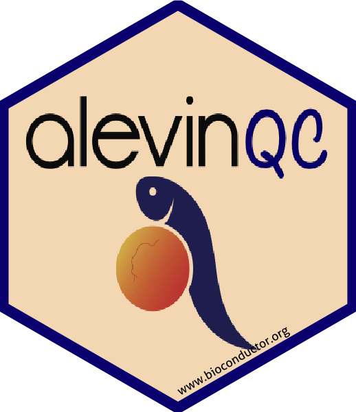
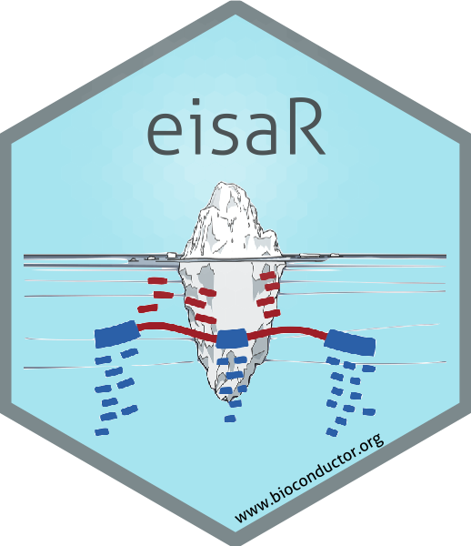

# About us: 

- [Our homepage at FMI &nbsp; &nbsp; ](http://www.fmi.ch/research/platforms/platform.html?plt=115)  

- [Our group page at SIB &nbsp; &nbsp; ](https://www.sib.swiss/stadler-michael/michael-stadler-sub)  

# Teaching material
- **SIB Advanced topics in single-cell analysis - 2022**  
  [Course homepage](https://www.sib.swiss/training/course/20220426_ADVSC) |
  [Course repository](https://github.com/fmicompbio/adv_singlecell_2022)  

- **Joint SIB / SciLifeLab Advanced topics in single-cell omics - 2021**  
  [Course homepage](https://nbisweden.github.io/single-cell_sib_scilifelab_2021) |
  [Course repository](https://github.com/NBISweden/single-cell_sib_scilifelab_2021)  

- **SIB Advanced topics in single-cell transcriptomics - 2020**  
  [Course homepage](https://www.sib.swiss/training/course/2020-05-adv-scrna) |
  [Course repository](https://github.com/fmicompbio/adv_scrnaseq_2020)  

- **Joint SIB / SciLifeLab Autumn School Single Cell Analysis - 2019**  
  [Course homepage](https://www.sib.swiss/component/courses/525?view=courses_item) |
  [Course repository](https://github.com/NBISweden/single-cell_sib_scilifelab)
  
- **SIB Single-cell RNA-Seq Analysis - 2018**  
  [Course homepage](https://www.sib.swiss/training/course/2018-11-single-cell) |
  [Course handout](https://fmicompbio.github.io/SIB_scRNA-seq_Tutorial_2018/)  

  
# Public software and data  

- **QuasR**: Quantification and Annotation of Short reads in R  
  [Bioconductor landing page](https://bioconductor.org/packages/QuasR/) |
  [PubMed](https://www.ncbi.nlm.nih.gov/pubmed/25417205) |
  [free HTML](https://www.ncbi.nlm.nih.gov/pmc/articles/PMC4382904/) |
  [free PDF](https://www.ncbi.nlm.nih.gov/pmc/articles/PMC4382904/pdf/btu781.pdf)  
  [GitHub repo](https://github.com/fmicompbio/QuasR)  

- **Rbowtie**: R wrapper around the popular bowtie short read aligner  
  [Bioconductor landing page](https://bioconductor.org/packages/Rbowtie/) |
  [PubMed](https://www.ncbi.nlm.nih.gov/pubmed/25417205) |
  [free HTML](https://www.ncbi.nlm.nih.gov/pmc/articles/PMC4382904/) |
  [free PDF](https://www.ncbi.nlm.nih.gov/pmc/articles/PMC4382904/pdf/btu781.pdf)  
  [GitHub repo](https://github.com/fmicompbio/Rbowtie)  

- **Rhisat2**: R wrapper around the hisat2 aligner  
  [Bioconductor landing page](https://bioconductor.org/packages/Rhisat2/) |
  [GitHub repo](https://github.com/fmicompbio/Rhisat2)  

- **MethylSeekR**: Identification of active regulatory regions from DNA methylation data  
  [Bioconductor landing page](https://bioconductor.org/packages/MethylSeekR/) |
  [PubMed](https://www.ncbi.nlm.nih.gov/pubmed/23828043) |
  [free HTML](https://www.ncbi.nlm.nih.gov/pmc/articles/PMC3763559/) |
  [free PDF](https://www.ncbi.nlm.nih.gov/pmc/articles/PMC3763559/pdf/gkt599.pdf)  
  [GitHub repo](https://github.com/LukasBurger/MethylSeekR)  

- **monaLisa**: Motif Enrichment Analysis and Visualization  
  [Bioconductor landing page](https://bioconductor.org/packages/monaLisa/) |
  [PubMed](https://pubmed.ncbi.nlm.nih.gov/35199152) |
  [GitHub repo](https://github.com/fmicompbio/monaLisa)

- **griph**: Graph Inference of Population Heterogeneity  
  [GitHub repo](https://github.com/fmicompbio/griph)  

- **swissknife**: Handy code shared in the FMI CompBio group  
  [GitHub repo](https://github.com/fmicompbio/swissknife)  

- **alevinQC**: Generation of QC and summary reports for [alevin](https://salmon.readthedocs.io/en/latest/alevin.html) and [alevin-fry](https://alevin-fry.readthedocs.io/en/latest/) output	
  [Bioconductor landing page](https://bioconductor.org/packages/alevinQC/) | 
  [GitHub repo](https://github.com/csoneson/alevinQC)

- **galaxy2shiny2galaxy**: Combining [Galaxy](https://galaxyproject.org/) with an external Shiny server	
  [GitHub page](https://github.com/hrhotz/galaxy2shiny2galaxy)  

- **ExploreModelMatrix**: Interactive exploration of design matrices in R.  
  [Bioconductor landing page](https://bioconductor.org/packages/ExploreModelMatrix/) | 
  [PubMed](https://pubmed.ncbi.nlm.nih.gov/32704355/) |
  [free full-text](https://f1000research.com/articles/9-512/v1) |
  [GitHub repo](https://github.com/csoneson/ExploreModelMatrix)

- **eisaR**: Exon-Intron Split Analysis and methods for extracting transcript coordinates and sequences  
  [Bioconductor landing page](https://bioconductor.org/packages/eisaR/) |
  [GitHub repo](https://github.com/fmicompbio/eisaR)  

- **TabulaMurisSenisData**: Access to bulk and single-cell RNA-seq data from the [Tabula Muris Senis](https://tabula-muris-senis.ds.czbiohub.org/) project in SingleCellExperiment format  
  [Bioconductor landing page](https://bioconductor.org/packages/TabulaMurisSenisData/) |
  [GitHub repo](https://github.com/fmicompbio/TabulaMurisSenisData)  

- **sketchR**: An R interface for python subsampling/sketching algorithms  
  [GitHub repo](https://github.com/fmicompbio/sketchR)  

- **mutscan**: An R package for processing, statistical analysis and visualization of Multiplexed Assays of Variant Effect data    
  [PubMed](https://pubmed.ncbi.nlm.nih.gov/37264470/) |
  [free full-text](https://doi.org/10.1186/s13059-023-02967-0) |
  [GitHub repo](https://github.com/fmicompbio/mutscan)  

- **einprot**: A collection of workflows for statistical analysis of quantitative proteomics data  
  [free full-text](https://doi.org/10.21105/joss.05750) |
  [GitHub repo](https://github.com/fmicompbio/einprot)  

- **orthos**: Mechanistic insights from differential gene expression experiments with Deep Generative Networks  
  [Bioconductor landing page](https://bioconductor.org/packages/orthos/) |
  [GitHub repo](https://github.com/fmicompbio/orthos) 
  
- **orthosData**: Companion package to **orthos**, providing access to data objects required for the methods therein  
  [Bioconductor landing page](https://bioconductor.org/packages/orthosData/) |
  [GitHub repo](https://github.com/fmicompbio/orthosData) 

# Supplementary information  
- **COSIE**: COrrected Splicing Indices for Exon arrays  
  [supplementary data and R code](projects/cosie/cosie.html) |
  [PubMed](https://www.ncbi.nlm.nih.gov/pubmed/19528075) |
  [free HTML](https://www.ncbi.nlm.nih.gov/pmc/articles/PMC2760813/) |
  [free PDF](https://www.ncbi.nlm.nih.gov/pmc/articles/PMC2760813/pdf/gkp508.pdf)  

- **GLD-1 Binding Motif (GBM) finder**  
  [supplementary R code](projects/GBM_finder/gbmFinder.html)  

- **MethylSeekR**  
  [supplementary data](projects/MethylSeekR/MethylSeekR.html)  

- **EISA**: Exon-Intron Split Analysis (see also `eisaR` package above)  
  [supplementary data and R code](projects/EISA/EISA.html) |
  [PubMed](https://www.ncbi.nlm.nih.gov/pubmed/26098447) |
  [HTML](http://www.nature.com/articles/nbt.3269) |
  [PDF](http://www.nature.com/articles/nbt.3269.pdf)  
  
# Software build status
... is available [here](build.html). 
